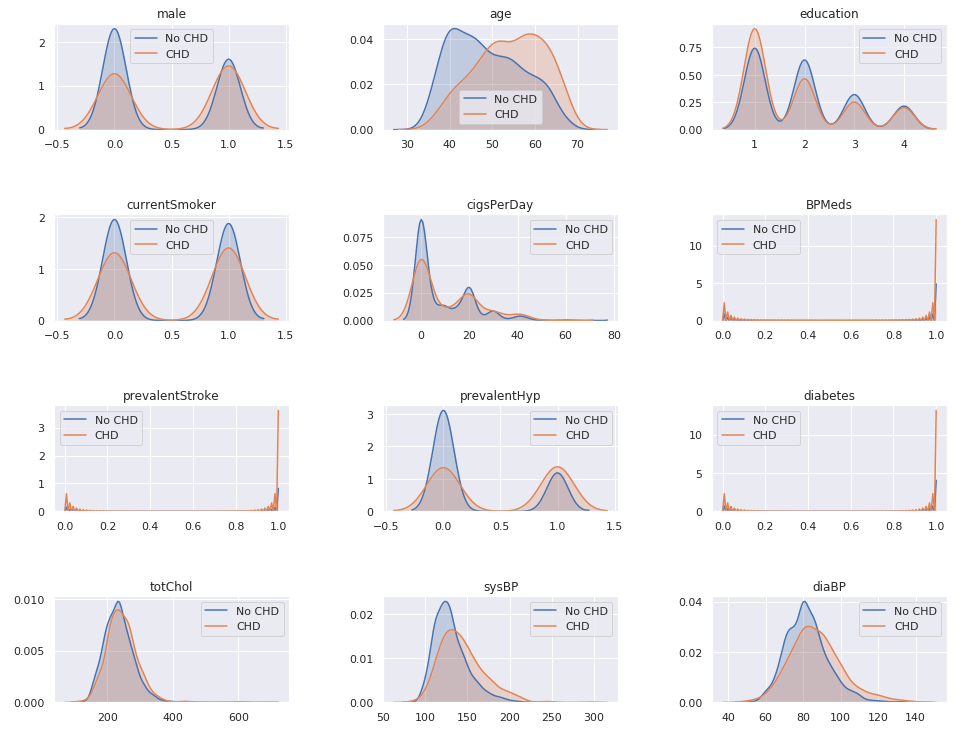
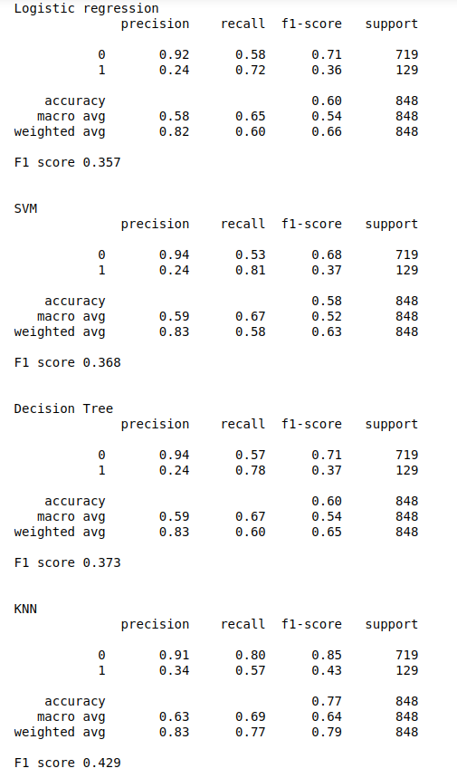

# Framingham-HeartDisease
Jupyter notebook comparing various supervised learning methods for predicting Coronary Heart Disease 

## Sample screenshots

**Distribution of features for CHD and non-CHD outcomes**

**Results for various machine learning methods**

